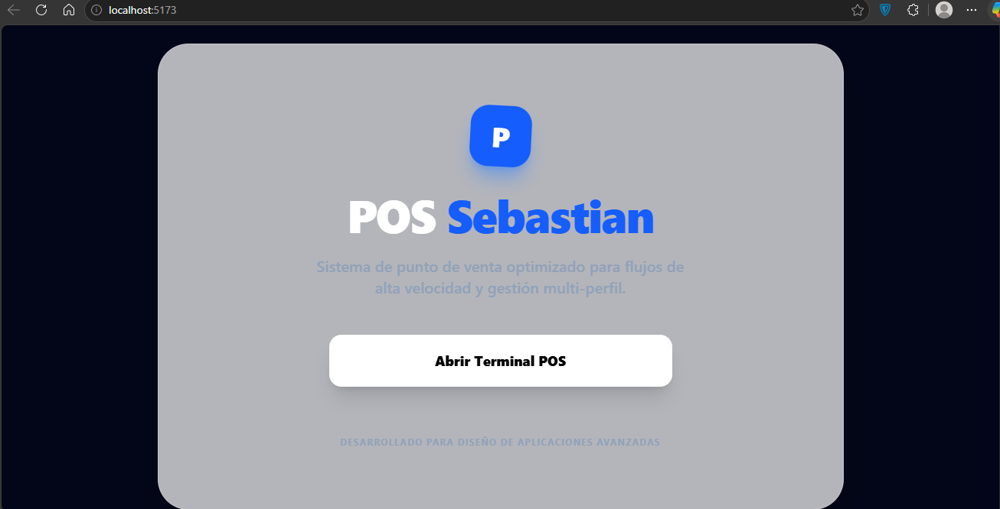
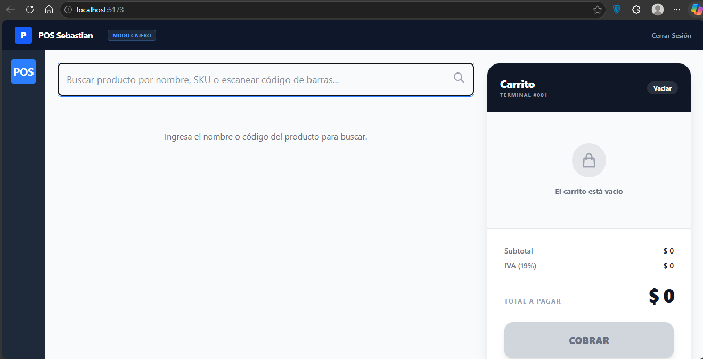

# 🛒 Sistema POS Universitario


Proyecto universitario de Diseño de Aplicaciones Avanzadas: Un sistema de Punto de Venta (POS) desarrollado usando la metodología **Spec-Driven Development (SDD)** y **Arquitectura Hexagonal (Puertos y Adaptadores)**.



## 📂 Estructura del Proyecto

El repositorio está dividido en dos partes principales, ambas siguiendo principios SOLID y Arquitectura Limpia:

- `pos-frontend/`: Aplicación cliente (Terminal POS para el Cajero) construida con React, TypeScript y Zustand. Estructurada bajo `core`, `features` y `adapters`.
- `pos-sales-api/`: API RESTful para la gestión de ventas, construida con Java 17 y Spring Boot. Estructurada bajo `domain`, `application`, `adapter` e `infrastructure`.
- `docs/`: Archivos de documentación y reflexiones sobre SDD.
- `.kiro/`: Contiene los archivos de especificación (`requirements.md`, `design.md`, `tasks.md`).

---

## ✨ Características del Frontend



- **Búsqueda Dinámica (Fuzzy Search):** La cuadrícula de productos no se muestra por defecto. Los productos solo aparecen en tiempo real mientras el cajero escribe el nombre o escanea el código de barras.
- **Carrito de Compras:** Cálculo en tiempo real del subtotal, IVA (19%) y total.
- **Arquitectura Hexagonal:** Separación estricta entre la lógica de negocio (`core`), la UI (`features`) y los gestores de estado (`adapters`).

## ✨ Características del Backend API

- **Manejo Preciso del Dinero:** Uso estricto de `BigDecimal` en todos los cálculos monetarios.
- **Flujo de Ventas Completo:** Creación de ventas, adición de items con validación de stock, y proceso de Checkout.
- **Base de Datos en Memoria:** Uso de H2 y Spring Data JPA para la persistencia inmediata.

---

## 🚀 Cómo ejecutar el proyecto

### 1. Levantar el Frontend
```bash
cd pos-frontend
npm install
npm run dev
```

### 2. Levantar el Backend (API)
Abre la carpeta `pos-sales-api` en tu IDE de Java (IntelliJ IDEA o VS Code) y ejecuta la clase principal `PosSalesApplication.java`, o usa el comando de Maven:
```bash
cd pos-sales-api
./mvnw spring-boot:run
```
